```{r setup, include=FALSE}
library(knitr)
library(tidyverse)
library(fontawesome)
library(countdown)
library(metathis)

options(
  htmltools.dir.version = FALSE,
  knitr.table.format = "html",
  knitr.kable.NA = '',
  dplyr.width = Inf,
  width = 250
)

knitr::opts_chunk$set(
  cache = FALSE,
  warning = FALSE,
  message = FALSE,
  fig.path = "figs/",
  fig.width = 7.252,
  fig.height = 4,
  comment = "#>",
  fig.retina = 3
)

# Setup xaringanExtra options
xaringanExtra::use_xaringan_extra(c(
  "tile_view", "panelset", "clipboard", "share_again"))
xaringanExtra::style_share_again(share_buttons = "none")
xaringanExtra::use_extra_styles(
  hover_code_line = TRUE,
  mute_unhighlighted_code = FALSE
)

# Set up website metadata
meta() %>%
  meta_general(
    description = rmarkdown::metadata$subtitle,
    generator = "xaringan and remark.js"
  ) %>%
  meta_name("github-repo" = "jhelvy/dtais-dataviz") %>%
  meta_social(
    title = rmarkdown::metadata$title,
    url = "https://jhelvy.github.io/dtais-dataviz/",
    og_type = "website",
    og_author = "John Paul Helveston",
    twitter_card_type = "summary_large_image",
    twitter_creator = "@johnhelveston"
  )
```

class: middle, inverse
background-color: #000

# .center[.fancy[`r rmarkdown::metadata$title`]]

.leftcol60[
<center>
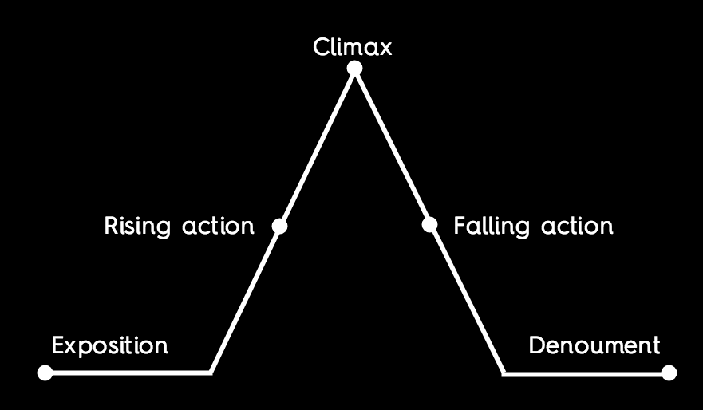
</center>
]

.rightcol40[

### `r fontawesome::fa(name = "university", fill = "white")` `r rmarkdown::metadata$subtitle`
### `r fontawesome::fa(name = "user", fill = "white")` `r rmarkdown::metadata$author`
### `r fontawesome::fa(name = "calendar-alt", fill = "white")` `r rmarkdown::metadata$date`
]

---

class: middle, center

# Download [this cheatsheet](https://jhelvy.github.io/dtais-dataviz/content/cheatsheet-storytelling.pdf) for today's content

---

```{r child="topics/0.Rmd"}
```

---

```{r child="topics/1.Rmd"}
```

---

class: inverse, middle, center

# What is a story?

---

class: middle

> ### A story is a set of observations, facts, or events...that are presented in a specific order such that they create an</br>**emotional reaction** in the audience.</br></br>- Clause O. Wilke (2019), Chp. 29

---

background-color: #fff
class: middle, center

</br>
<center>

</center>

[source](https://sivers.org/drama)

---

background-color: #fff
class: middle, center

</br>
<center>
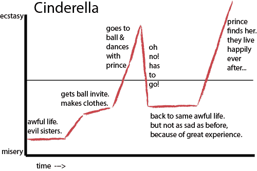
</center>

[source](https://sivers.org/drama)

---

background-color: #fff
class: middle, center

</br>
<center>

</center>

[source](https://sivers.org/drama)

---

background-color: #000
class: inverse, middle, center

## [.orange[Freytag's Pyramid]](https://en.wikipedia.org/wiki/Gustav_Freytag)

<center>

</center>

---

background-color: #fff
class: center, middle

### Freytag's Pyramid: **[King Kong](https://en.wikipedia.org/wiki/King_Kong)**

<center>
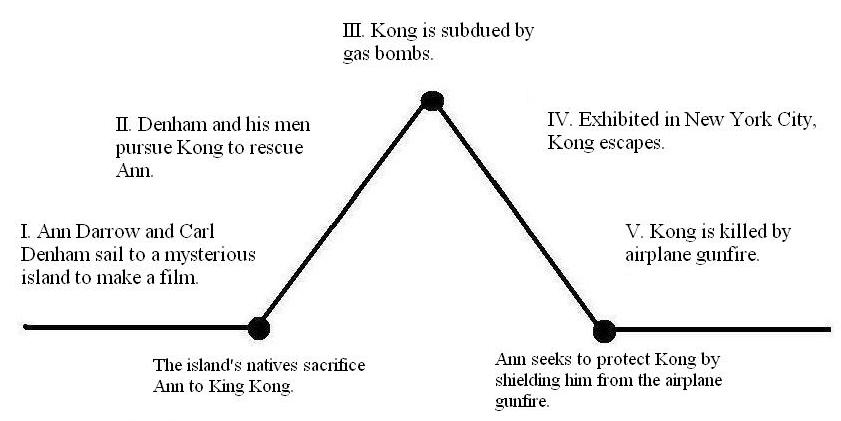
</center>

[source](http://writinghorrorfiction.blogspot.com/2011/03/putting-freytags-pyramid-to-use-in.html)

---

background-color: #fff
class: center

### Freytag's Pyramid: **Research Project**

<center>
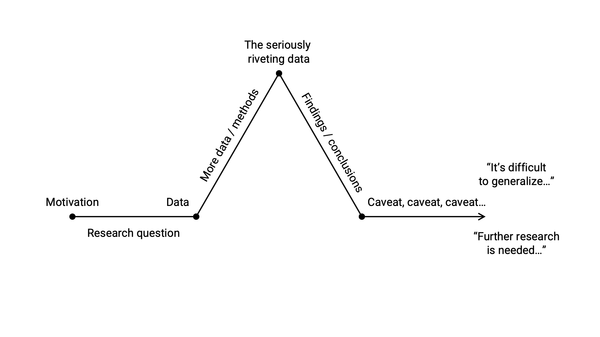
</center>

---

background-color: #fff
class: center

## Freytag's Pyramid: **Research Project**

<center>

</center>

---

class: middle

> ### "A single (static) visualization will rarely tell an entire story"</br></br>- Clause O. Wilke (2019), Chp. 29

---

background-color: #fff
class: center

## Freytag's Pyramid: **Research Project**

<center>

</center>

---

class: center

## Use **layers** to build tension / provide context

--

<center>

</center>

---

class: center

## Use **layers** to build tension / provide context

<center>

</center>

---

class: center

## Use **layers** to build tension / provide context

<center>
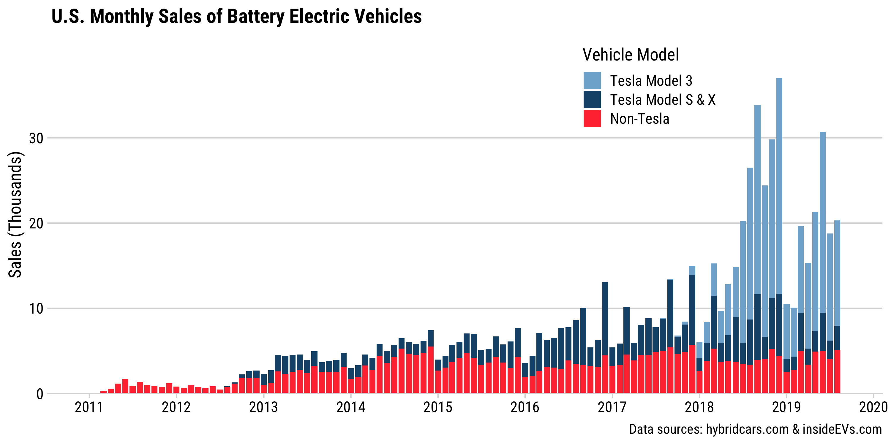
</center>

---

class: center

## Use **animation** to build tension / provide context

<center>

</center>

[source](https://www.vox.com/2020/4/2/21203850/unemployment-initial-claims-march-28)

---

class: center

## Use **animation** to build tension / provide context

<center>

</center>

[source](https://twitter.com/maoam_guy/status/1245887052027232256)

---

class: center

## Make charts for the generals
### (i.e. keep it simple)

--

<center>

</center>

[source](https://serialmentor.com/dataviz/telling-a-story.html#make-a-figure-for-the-generals)

---

class: center

## Make charts for the generals
### (i.e. keep it simple)

.leftcol[
<center>
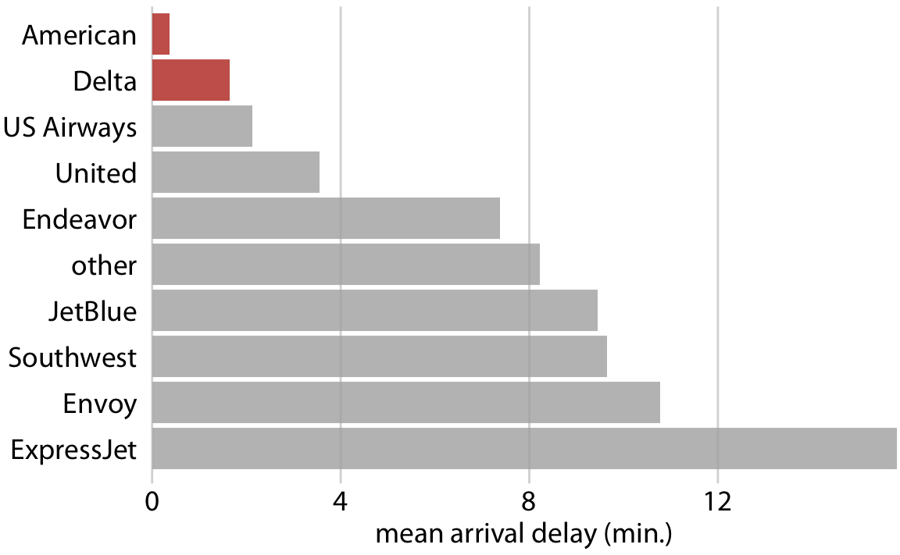
</center>
[source](https://serialmentor.com/dataviz/telling-a-story.html#make-a-figure-for-the-generals)
]

--

.rightcol[
<center>

</center>

[source](https://serialmentor.com/dataviz/telling-a-story.html#make-a-figure-for-the-generals)
]

---

class: center

# Build up towards complex figures

--

<center>
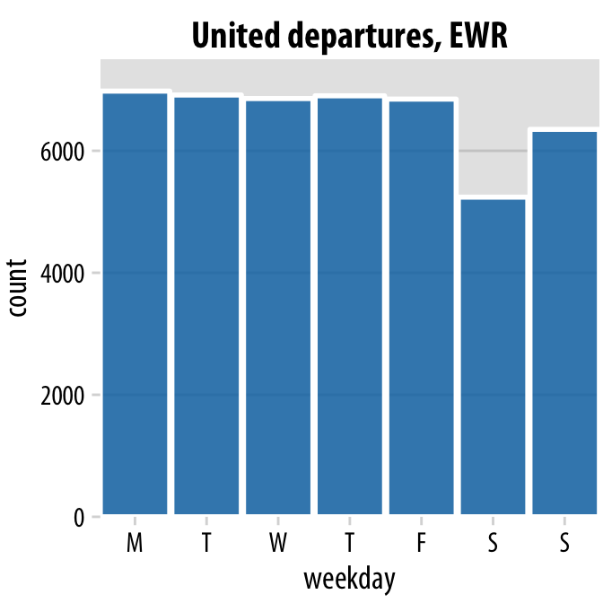
</center>

[source](https://serialmentor.com/dataviz/telling-a-story.html#build-up-towards-complex-figures)

---

class: center

# Build up towards complex figures

<center>
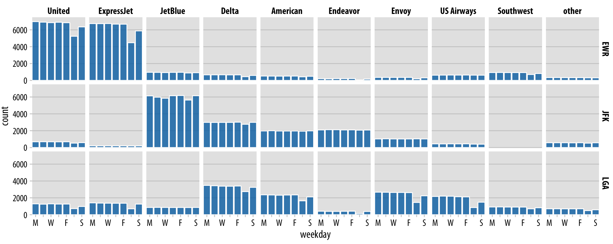
</center>

[source](https://serialmentor.com/dataviz/telling-a-story.html#build-up-towards-complex-figures)

---

class: center

## Be consistent, but don't be repetitive

--

.leftcol[
<center>
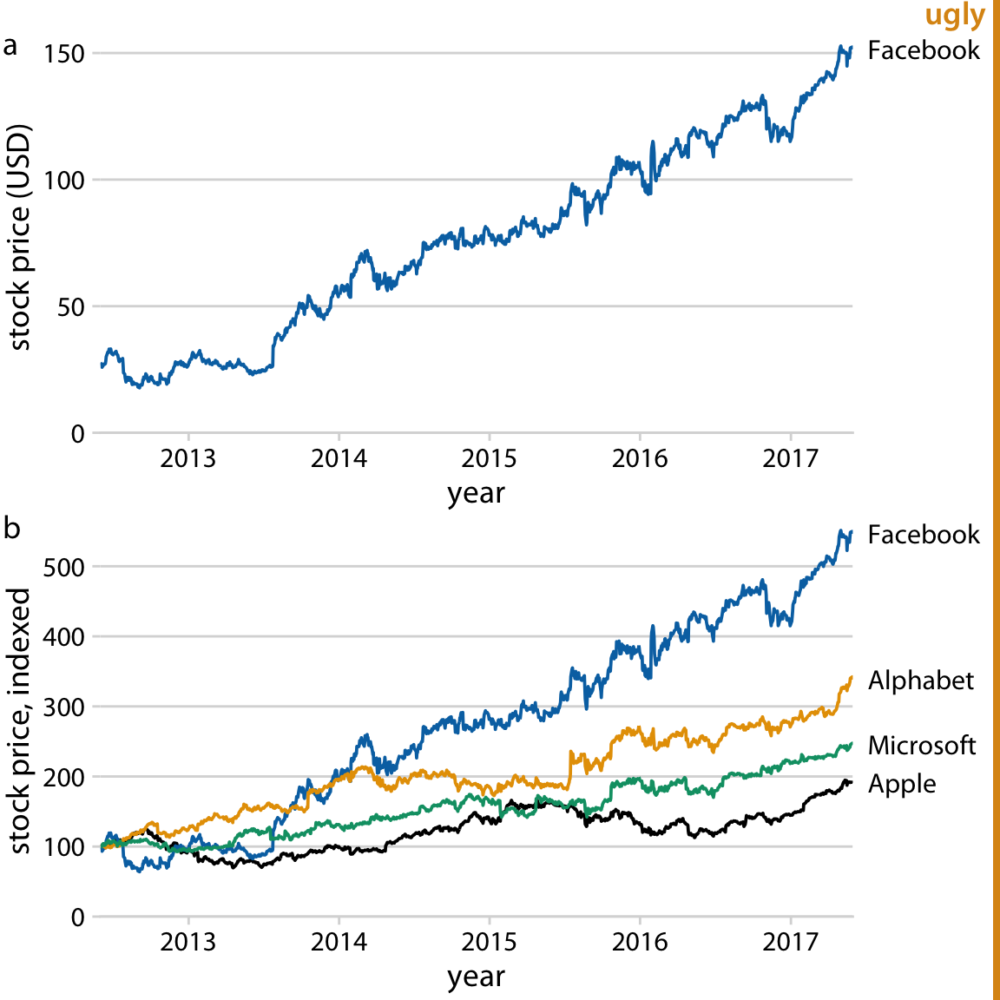
</center>

[source](https://serialmentor.com/dataviz/telling-a-story.html#be-consistent-but-dont-be-repetitive)
]

--

.rightcol[
<center>
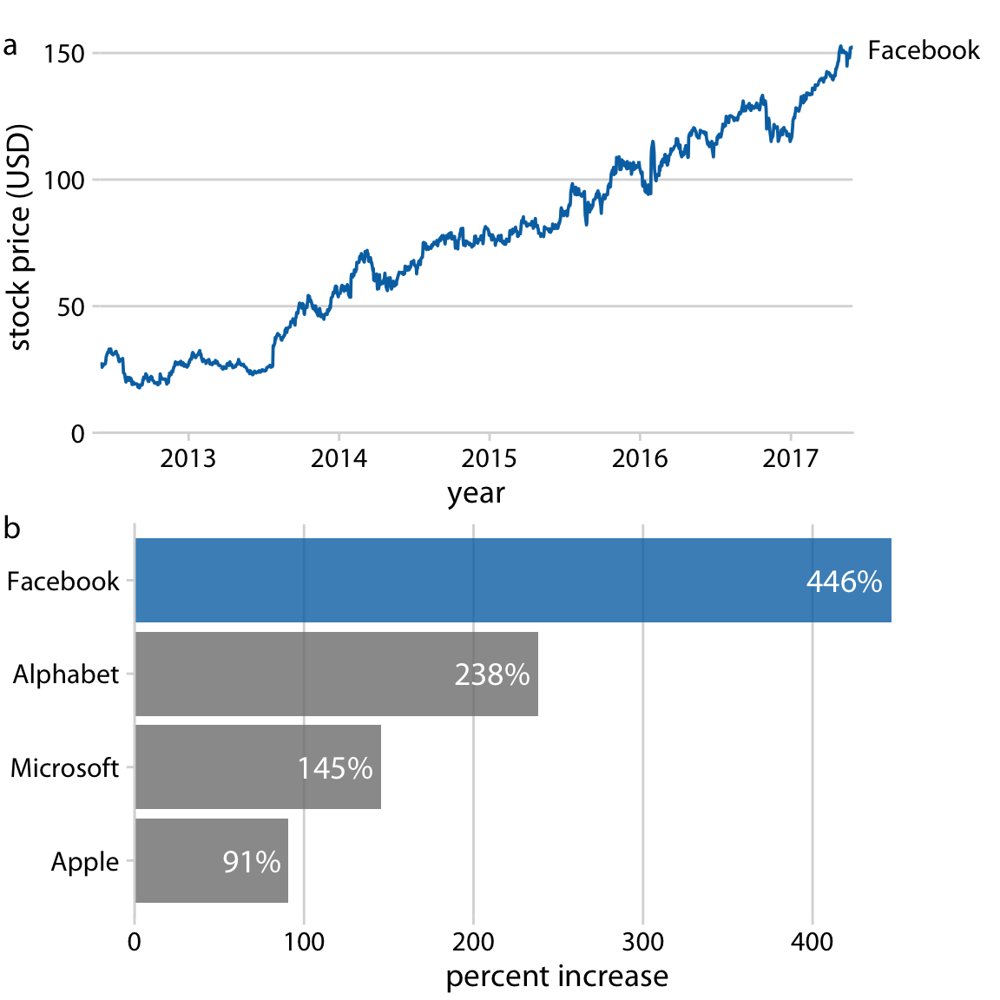
</center>

[source](https://serialmentor.com/dataviz/telling-a-story.html#be-consistent-but-dont-be-repetitive)
]

---

```{r child="topics/2.Rmd"}
```

---

class: inverse, middle, center

# Hitchcock's rule

<center>

</center>

---

class: middle

## .center[Hitchcock's rule]

> # The size of any object in your frame should be proportional to its importance to the story at that moment

## .center[[Watch this example](https://youtu.be/E1LzhiCcOY0?t=174)]

---

class: middle

## .center[Hitchcock's rule]

> # The size of any object in your ~~frame~~ **slide** should be proportional to its importance to the story at that moment

---

...and finally you will read this

<br><br>
<div style='font-size: 70pt; text-align: center;'>You will read this first</div>

<br><br>
<div style='font-size: 40pt; text-align: center;'>and then you will read this</div>

---

class: center

# Put main point at top and use big font size!

</br>
</br>

## (see Stephanie Evergreen's blog post ["So What?"](https://stephanieevergreen.com/so-what/))

---

class: center

# Except for Tesla, EV adoption in the U.S. is **flat**

<center>

</center>

---

class: center

# Tesla's Model 3 is a **Game Changer** for EVs

<center>

</center>

---

class: center

<p style="font-size:40pt;">> 40pt font for titles</p>
<p style="font-size:24pt;">> 24pt font for all other text</p>

(Exception: footer text can be small)

<div class="footer-small"><span>Footer text</span></div>

---

class: inverse, center, middle

# Fonts matter

.leftcol[
<center>

</center>

"Fast Taco"
]

.rightcol[
<center>
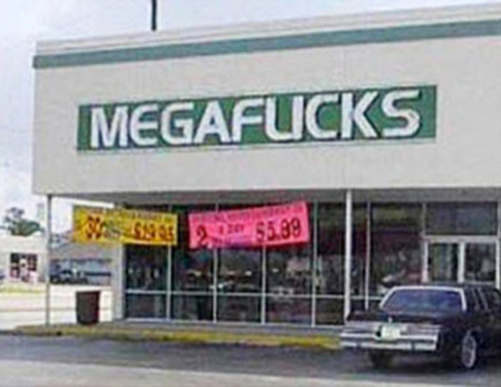
</center>

"Mega Flicks"
]

---

class: inverse, center, middle

<center>

</center>

---

# .center[.red[_Use fonts to encode meaning_]]

--

<br><br>
<center>
<div style="font-size: 40pt;">
San-serif fonts for most text
</div>
</center>

--

<br><br>
<center>
<div style="font-size:40pt; font-style:italic; font-family: serif;">
"Italic, serif fonts for quotes"
<br>- Prof. Helveston
</div>
</center>

---

## Use fonts to create **hierarchy**

.leftcol[

```
# Hierarchy

## Hierarchy

### Hierarchy

#### Hierarchy
```

]

.rightcol[

# Hierarchy

## Hierarchy

### Hierarchy

#### Hierarchy

]

---

.leftcol[

Title<br>This is some text that goes into detail and explains a lot more about the topic described in the title. Here's some random Latin words: Lorem ipsum dolor sit amet, consectetur adipiscing elit, sed do eiusmod tempor incididunt ut labore et dolore magna aliqua.

]

---

.leftcol[

# Size

This is some text that goes into detail and explains a lot more about the topic described in the title. Here's some random Latin words: Lorem ipsum dolor sit amet, consectetur adipiscing elit, sed do eiusmod tempor incididunt ut labore et dolore magna aliqua.

]

---

.leftcol[

**Weight**

This is some text that goes into detail and explains a lot more about the topic described in the title. Here's some random Latin words: Lorem ipsum dolor sit amet, consectetur adipiscing elit, sed do eiusmod tempor incididunt ut labore et dolore magna aliqua.

]

---

.leftcol[

.red[Color]

This is some text that goes into detail and explains a lot more about the topic described in the title. Here's some random Latin words: Lorem ipsum dolor sit amet, consectetur adipiscing elit, sed do eiusmod tempor incididunt ut labore et dolore magna aliqua.

]

---

.leftcol[

Spacing

<br>

This is some text that goes into detail and explains a lot more about the topic described in the title. Here's some random Latin words: Lorem ipsum dolor sit amet, consectetur adipiscing elit, sed do eiusmod tempor incididunt ut labore et dolore magna aliqua.

]

---

.leftcol[

Typeface

<p style="font-family: Alegreya;">
This is some text that goes into detail and explains a lot more about the topic described in the title. Here's some random Latin words: Lorem ipsum dolor sit amet, consectetur adipiscing elit, sed do eiusmod tempor incididunt ut labore et dolore magna aliqua.
</p>

]

---

.center[### Combine color, weight, spacing, and typeface to generate _texture_]

.leftcol[

<h2 style="font-family: Roboto Condensed; color: #a5442b;">Title</h2>
<h3 style="font-family: Alegreya;">Subtitle</h3>

<p style="font-family: Roboto;">
This is some text that goes into detail and explains a lot more about the topic described in the title. Here's some random Latin words: Lorem ipsum dolor sit amet, consectetur adipiscing elit, sed do eiusmod tempor incididunt ut labore et dolore magna aliqua.
</p>

]

---

# .center[Use fonts with **same-height** numbers]
<br>

.leftcol35[.right[

## "Oldstyle" (bad)

## Lining (good)

]]

.rightcol65[


]

---

# .center[Use fonts with **same-width** numbers]

# .center[("Mono" fonts)]

<br>

.leftcol40[.right[

## "Proportional" (bad)

## "Tabular" (good)
]]

.rightcol60[

]

---

## .center[Font families you should consider using]

.leftcol30[.font140[

<p style="font-family: Roboto;">Roboto</p>

<p style="font-family: Fira Sans;">Fira Sans</p>

<p style="font-family: Source Code Pro;">Source Code pro</p>

<p style="font-family: Alegreya;">Alegreya</p>

<p style="font-family: Lato;">Lato</p>

]]

.rightcol70[

### Download from https://fonts.google.com/

]

---

class: center, middle

# Avoid fonts like

</br>
<div style='font-family: "Comic Sans MS"; font-size: 40pt'>Comic Sans</div>
</br>
<div style='font-family: "Papyrus"; font-size: 40pt'>Papyrus</div>
</br>
</br>

# They make your work look amateurish

---

class: middle, center

# Consider using a light-colored background<br>(tan / gray)

---

class: center

# Use high contrast between font and background color

</br>

.leftcol[
<center>
<div style="background-color: #FFF; padding: 50px; margin: 0px; width: 300px; font-size: 28pt;">
Dark text on a light background works well
</div>
</center>
]

.rightcol[
<center>
<div style="background-color: #000; color: #FFF; padding: 50px; margin: 0px; width: 300px; font-size: 28pt;">
Light text on a dark background also works well
</div>
</center>
]

---

class: center

# Use high contrast between font and background color

</br>

.leftcol[
<center>
<div style="background-color: #FFF; color: #ffef01; padding: 50px; margin: 0px; width: 350px; font-size: 28pt;">
Yellow text on a white background is horrible
</center>
]

.rightcol[
<center>
<div style="background-color: #000; color: #0000ff; padding: 50px; margin: 0px; width: 350px; font-size: 28pt;">
Blue text on a black background is horrible
</center>
]

---

class: middle, center

# 1 slide, 1 idea

## Break up main points into multiple slides

---

class: middle, center

# Number your slides!

---

class: middle, center

.noborder[
<center>

</center>
]

---

class: center

</br></br></br></br></br></br>

# Example of an acceptable slide footer

# </br></br></br>&darr;

<div class="footer-small"><span>Data source: http://somesourceofdata.com &emsp;&emsp; © John Paul Helveston, GWU, July 2022</span></div>

---

class: middle

# .center[If you are in person, consider using handouts<br><br>(1-2 pages)]

<br>

## **Helps your audience**:

## 1. Preview your results
## 2. Take notes 
## 3. Remember your main points

---

```{r child="topics/3.Rmd"}
```

---

class: middle, inverse, center

# What are the first words<br>you should say in a speech?

--

## Watch [this video](https://youtu.be/w82a1FT5o88) to find out

---

# How to start a speech

--

### 3. With a question that matters to the audience ("Have you ever...?")

--

### 2. With a shocking factoid ("40k people died in car accidents last year").

--

### 1. Tell a story, talk about **people** ("Imagine...")

---

# How **not** to start a speech

--

### 1. Read the title slide

--

### 2. Fiddling with the computer

---

background-color: #000
class: inverse, middle, center

<center>

</center>

---

class: middle

<center>

</center>

--

3) With a question that matters to the audience:

**"What's the current federal subsidy for buying an electric car in the US?"**

--

2) With a shocking factoid

**"50% of the world's EVs are made by Chinese automakers"**

--

1) Tell a story, talk about **people**

**"Whenever I mention electric cars, most people think "Tesla"..."**

---

class: inverse

## Your turn

```{r, echo=FALSE}
countdown(
  minutes = 10,
  warn_when = 30,
  update_every = 15,
  top = 0,
  font_size = '2em'
)
```

Brainstorm different strategies for how to start your presentation for your projects:

1. Tell a story, talk about **people** ("Imagine...").
2. With a **factoid** ("There are more people alive today than have ever lived...").
3. With a **question** that matters to the audience ("Have you ever...?").

Afterwards, we will go around and practice giving the start of each presentation.
