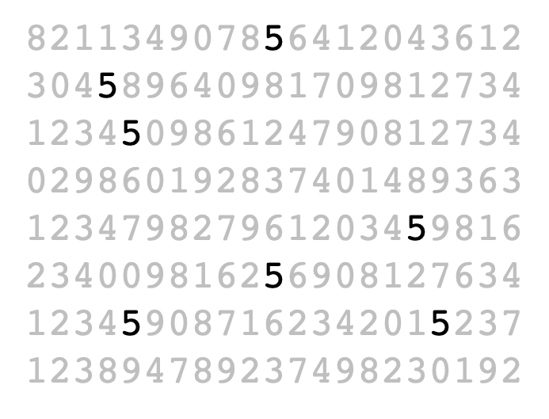
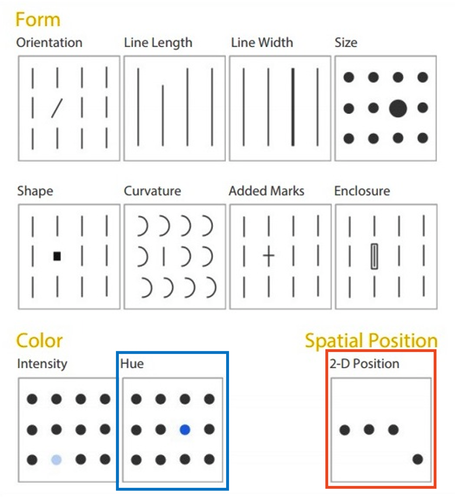
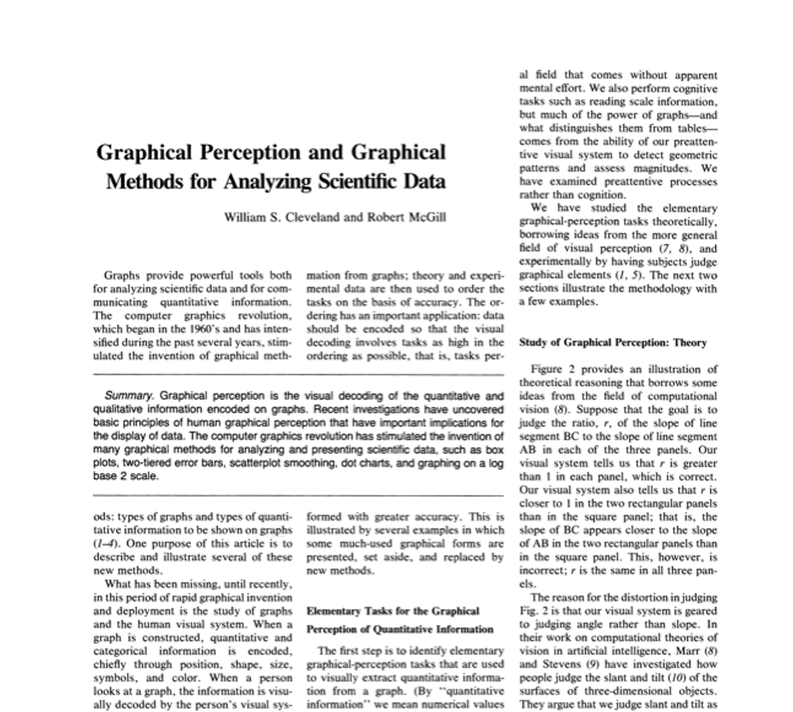
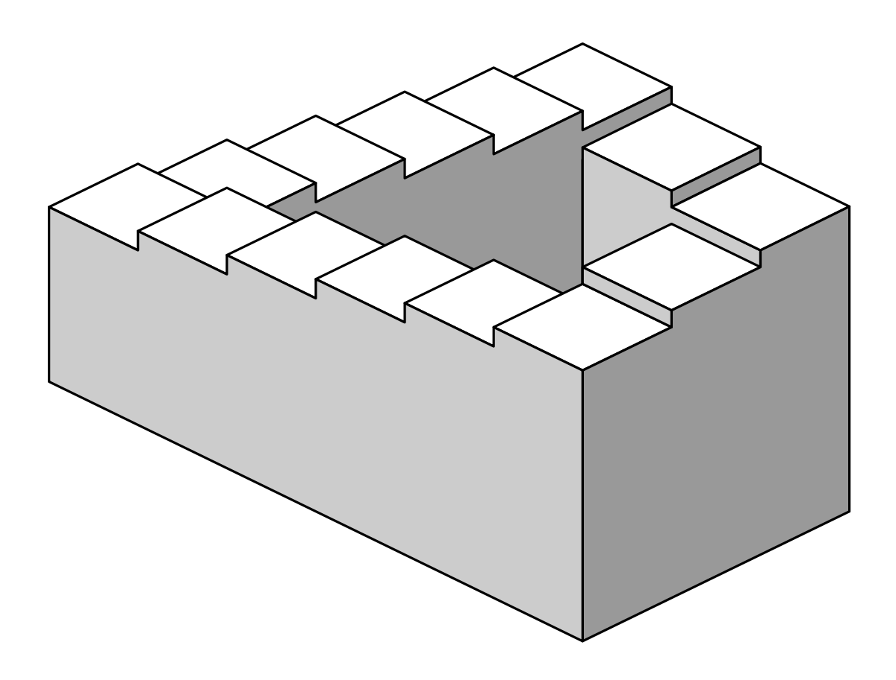
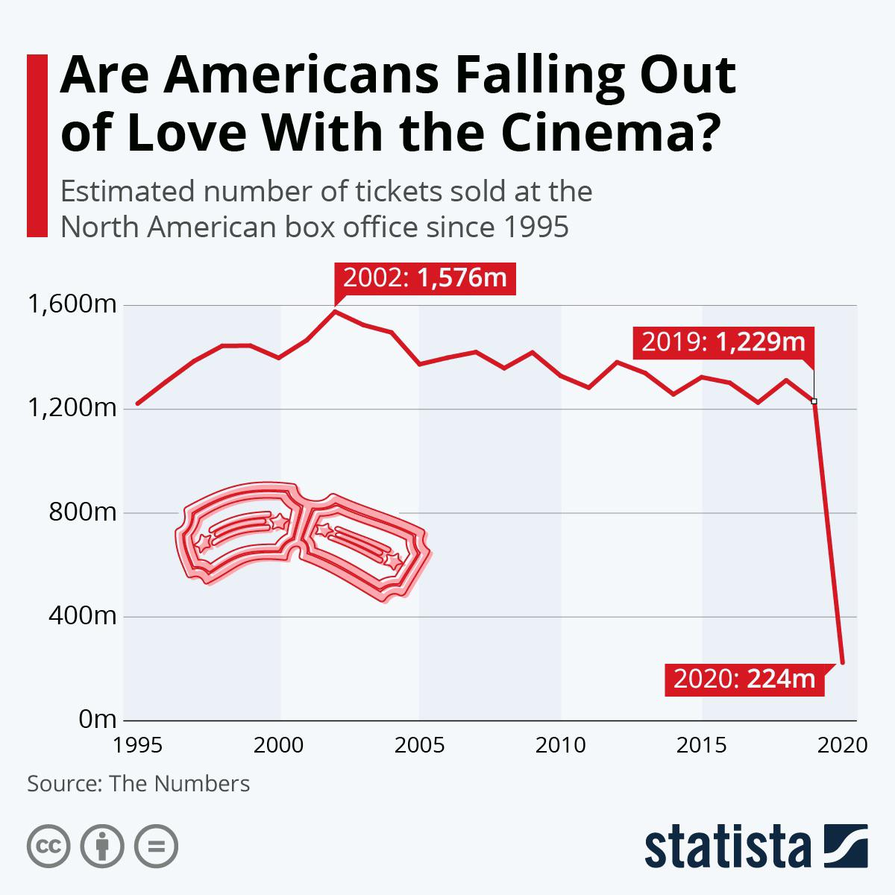
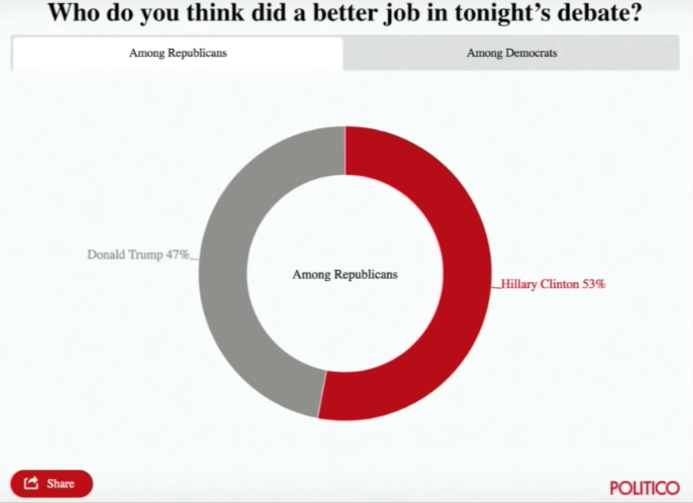
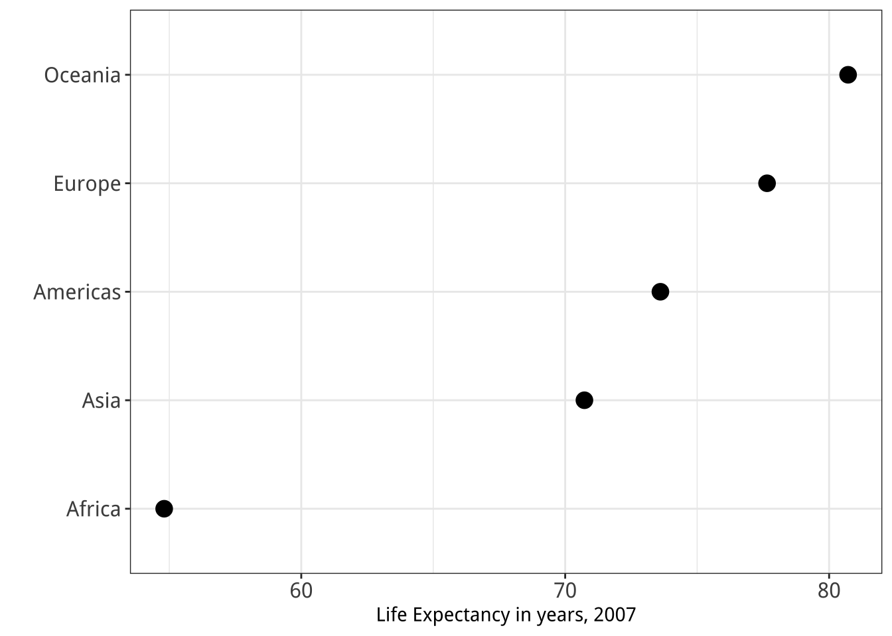

```{r}
#| label: setup
#| include: false

library(knitr)
library(tidyverse)
library(countdown)
library(metathis)
library(here)
library(fontawesome)
library(gapminder)

xaringanExtra::use_freezeframe()

options(
  htmltools.dir.version = FALSE,
  knitr.table.format = "html",
  knitr.kable.NA = '',
  dplyr.width = Inf,
  width = 250
)

knitr::opts_chunk$set(
  cache = FALSE,
  warning = FALSE,
  message = FALSE,
  fig.path = "figs/",
  fig.width = 7.252,
  fig.height = 4,
  comment = "#>",
  fig.retina = 3
)

# Set up website metadata
meta() %>%
  meta_general(
    description = rmarkdown::metadata$subtitle,
    generator = "xaringan and remark.js"
  ) %>%
  meta_name("github-repo" = "jhelvy/stories-with-data") %>%
  meta_social(
    title = rmarkdown::metadata$title,
    url = "https://jhelvy.github.io/stories-with-data/",
    og_type = "website",
    og_author = "John Paul Helveston",
    twitter_card_type = "summary_large_image",
    twitter_creator = "@johnhelveston"
  )
```

background-image: url("images/nasa_global_preview.png")
background-size: cover

<br><br><br><br><br><br><br><br>

.rightcol80[.white[

# .fancy[`r rmarkdown::metadata$title`]

### `r rmarkdown::metadata$author`
### The George Washington University 
### Dept. of Engineering Management & Systems Engineering

]]

---

class: middle, center

# Download [this cheatsheet](https://jhelvy.github.io/stories-with-data/content/cheatsheet-dataviz.pdf) for today's content

---

```{r child="topics/0.Rmd"}
```

---

```{r child="topics/1.Rmd"}
```

---

class: center, middle, inverse

# Check out John Rauser's [talk](https://www.youtube.com/watch?v=fSgEeI2Xpdc) on YouTube

---

class: inverse, middle, center

# Good visualizations optimize for our<br> .orange[Visual-Memory System]

---

class: center

## A (very) simplified model of the visual-memory system

<center>

</center>

---

class: center

## A (very) simplified model of the visual-memory system

<center>

</center>

---

class: center

## A (very) simplified model of the visual-memory system

<center>

</center>

---

class: center

## A (very) simplified model of the visual-memory system

<center>

</center>

---

class: inverse, middle

# Two objectives of effective charts:

## 1. Grab & direct attention (iconic memory)
## 2. Reduce processing demands (working memory)

---

class: center

# The power of pre-attentive processing

## Count all the "5"s

--

<center>

</center>

---

class: center

# The power of pre-attentive processing

## Count all the "5s

--

<center>

</center>

---

class: center

.leftcol[

<center>

</center>

]

--

.rightcol[

## Pre-attentive attributes

<br>
<center>

</center>

]

---

class: center

.leftcol[

<center>

</center>

]

.rightcol[

## Pre-attentive attributes

### .red[Numerical (ratio) data]

<center>

</center>

]

---

class: center

.leftcol[

<center>

</center>

]

.rightcol[

## Pre-attentive attributes

### .red[Numerical (ratio) data]<br>.blue[Categorical (ordinal) data]

<center>

</center>

]

---

class: inverse, middle, center

# Not all pre-attentive attributes are equal

---

class: center

# Where is the red dot?

--

.cols3[

<center>

</center>

]

--

.cols3[

<center>

</center>

]

--

.cols3[

<center>

</center>

]

---

# .center[For categorical data:]

### 1. Hue (color) > shape
### 2. Less is more (stay in working memory!)

.cols3[

<center>

</center>

]

.cols3[

<center>

</center>

]

.cols3[

<center>

</center>

]

---

class: middle

.leftcol[

<center>
<br>

</center>

]

--

.rightcol[

<center>


</center>

]

---

background-image: url("images/trump_covid.jpg")
background-size: cover

---

class: inverse, middle, center

# What about _quantitative_ data?

---

class: middle

.leftcol60[

<center>

</center>

]

--

.rightcol40[

Cleveland, W. S., & McGill, R. (1985). Graphical perception and graphical methods for analyzing scientific data. Science, New Series, 229(4716), 828-833.

]

---

name: cleveland-estimation
class: center, middle

# Hierarchy for _numerical_ data

<center>

</center>

.leftcol[

## .left[More Accurate]

]

.rightcol[

## .right[Less Accurate]

]

---

class: center

# Example: Life expectancy in countries in Asia

.leftcol[

```{r, echo=FALSE}
gapminder %>%
    filter(continent == "Asia") %>%
    filter(year == max(year)) %>%
    # Removing a "middle" country so that it's just 32 countries
    filter(country != "Sri Lanka") %>%
    mutate(country = ifelse(country == "Korea, Rep.", "Korea", as.character(country))) %>%
    arrange(lifeExp) %>%
    dplyr::select(country, lifeExp) %>%
    as.data.frame()
```

]

---

class: middle

.leftcol30[

1. Position on a common scale
2. Position on<br>non-aligned scales
3. Length
4. Angle
5. Area
6. Color saturation
7. **.red[Color hue]**

<br>

- `r fa("times", fill = "red")` **Discriminate**
- `r fa("times", fill = "red")` **Rank**
- `r fa("times", fill = "red")` **Ratio**

]

.right70[

<center>

</center>

]

---

class: middle

.leftcol30[

1. Position on a common scale
2. Position on<br>non-aligned scales
3. Length
4. Angle
5. Area
6. Color saturation
7. **.red[Color hue]**

Sorting helps a bit...

- `r fa("times", fill = "red")` **Discriminate**
- `r fa("check", fill = "green")` **Rank**
- `r fa("times", fill = "red")` **Ratio**

]

.right70[

<center>

</center>

]

---

class: middle

.leftcol30[

1. Position on a common scale
2. Position on<br>non-aligned scales
3. **.red[Length]**
4. Angle
5. Area
6. Color saturation
7. Color hue

<br>

- `r fa("check", fill = "green")` / `r fa("times", fill = "red")` **Discriminate**
- `r fa("check", fill = "green")` / `r fa("times", fill = "red")` **Rank**
- `r fa("check", fill = "green")` **Ratio**

]

.right70[

<center>

</center>

]

---

class: middle

.leftcol30[

1. Position on a common scale
2. **.red[Position on<br>non-aligned scales]**
3. Length
4. Angle
5. Area
6. Color saturation
7. Color hue

<br>

- `r fa("check", fill = "green")` / `r fa("times", fill = "red")` **Discriminate**
- `r fa("check", fill = "green")` / `r fa("times", fill = "red")` **Rank**
- `r fa("check", fill = "green")` **Ratio**

]

.right70[

<center>

</center>

]

---

class: middle

.leftcol30[

1. **.red[Position on a common scale]**
2. Position on<br>non-aligned scales
3. Length
4. Angle
5. Area
6. Color saturation
7. Color hue

<br>

- `r fa("check", fill = "green")` **Discriminate**
- `r fa("check", fill = "green")` **Rank**
- `r fa("check", fill = "green")` **Ratio**

]

.right70[

<center>

</center>

]

---

class: middle

.leftcol30[

1. **.red[Position on a common scale]**
2. Position on<br>non-aligned scales
3. Length
4. Angle
5. Area
6. Color saturation
7. Color hue

**.red[Sorting still matters!]**

]

.right70[

<center>

</center>

]

---

class: inverse, middle, center

# .font130[Gestalt Psychology]

<br>

### The whole has a reality that is entirely separate from the parts

---

class: middle
background-color: #FFFFFF

<center>

</center>

---

class: center
background-color: #FFFFFF

# Reification

<br>
<center>

</center>

---

class: center
background-color: #FFFFFF

.leftcol30[

# Emergence

]

.rightcol70[

<center>

</center>

]

---

background-color: #FFFFFF

.leftcol20[

# Law of Closure

Our minds fill in the missing information

]

.rightcol80[


]

---

class: inverse, center

# .font120[Prägnanz]

<br>

### We strongly prefer to interpret stimuli as regular, simple, and orderly

--

.cols3[

<center>

</center>

]

--

.cols3[

<center>

</center>

]

--

.cols3[

<center>

</center>

]

---

class: middle

.leftcol30[

# .font120[Prägnanz]

.font120[This should cause you cognitive pain]

It's the graphical equivalent of this:
<center>

</center>

]

.right70[

<center>

</center>

]

---

class: middle

.leftcol30[

# .font120[Prägnanz]

.font120[This makes our brains happy] 😊

]

.right70[

<center>

</center>

]

---

```{r child="topics/2.Rmd"}
```

---

```{r child="topics/dont0.Rmd"}
```

---

```{r child="topics/dont1.Rmd"}
```

---

class: inverse, middle

.rightcol80[

# "_Erase non-data ink._"
## — Ed Tufte

]

---

class: center, middle

.leftcol[

<center>


</center>

Figure 1.6: `Monstrous Costs’ by Nigel Holmes, in Healy, 2018

]

--

.rightcol[

<center>


</center>

]

---

class: middle

<center>

</center>

.left[Figure 24.1: From Data Looks Better Naked by Darkhorse Analytics]

---

class: center, middle

.leftcol[

<center>


</center>

]

--

.rightcol[

<center>


</center>

]

---

```{r child="topics/dont2.Rmd"}
```

---

class: center, middle

.leftcol[

## Humans aren't good at distinguishing 3D space

<center>

</center>

[Penrose Stairs](https://en.wikipedia.org/wiki/Penrose_stairs
), made famous by<br>M.C. Escher (1898-1972)

]

--

.rightcol[

## Ink proportions !=<br>true proportions

<center>

</center>

]

---

class: center, middle

# Occlusion: geoms are obscured

<center>

</center>

---

class: center, middle

.leftcol60[

<center>

</center>

]

.rightcol40[

# Multiple interpretations

]

---

class: center, middle

.leftcol40[

<center>


</center>

]

--

.rightcol60[

<center>

.border[]
</center>

]

---

class: center, middle

# The third dimension distracts from the data

## (this is what Tufte calls "chart junk")

<center>

</center>

---

class: center, middle

.leftcol60[

<center>


</center>

]

--

.rightcol40[

<center>

.border[]
</center>

]

---

```{r child="topics/dont3.Rmd"}
```

---

class: middle
background-color: #f8f8f8

<center>

</center>

---

class: middle, center

.leftcol[

<center>

.border[]
</center>

]

--

.rightcol[

<center>

.border[]
</center>

]

---

```{r child="topics/dont4.Rmd"}
```

---

class: center

# 10% of males and 1% of females are color blind

--

.leftcol[

<center>
.border[]
</center>

]

--

.rightcol[

<center>
.border[]
</center>

]

---

class: middle, center

## Facets can be used to avoid color altogether

.leftcol[

<center>

.border[]
</center>

]

--

.rightcol[

<center>

.border[]
</center>

]

---

```{r child="topics/dont5.Rmd"}
```

---

class: center, middle

# Bar charts should always start at 0

--

.leftcol60[

<center>


</center>

.font70[.left[

Image from http://livingqlikview.com/the-9-worst-data-visualizations-ever-created/

]]]

--

.rightcol40[

<center>

.border[]
</center>

]

---

class: center, middle

# Don't cherry pick your data

---

.leftcol[

<center>


</center>

https://x.com/PEWilliams_/status/1760688839193231550?s=20

]

--

.rightcol[

### .center[Don't cherry pick your data]

<center>


</center>

]

---

.leftcol[

<center>

</center>

]

.rightcol[

## Use common conventions

- "Up" on Y axis should mean larger
- Time moves left to right

<br><br><br><br><br><br><br><br><br><br>

.font80[https://www.livescience.com/45083-misleading-gun-death-chart.html]

]

---

class: center, middle

# Make sure your chart makes sense

<center>

</center>

.font70[.left[

Image from Image from http://livingqlikview.com/the-9-worst-data-visualizations-ever-created/

]]

---

class: inverse, center

```{r, echo=FALSE}
countdown(
    minutes = 5,
    warn_when = 30,
    update_every = 1,
    left = 0, right = 0, top = 1, bottom = 0,
    margin = "5%",
    font_size = "8em"
)
```

# Intermission!

## Stand up, Move around, Stretch!

---

```{r child="topics/3.Rmd"}
```

---

```{r child="topics/do0.Rmd"}
```

---

```{r child="topics/do1.Rmd"}
```

---

class: center, middle, inverse

# Text is usually the single most important component on your chart

---

class: middle

<center>

</center>

.font80[Michelle Borkin, et al. (2015) [Beyond Memorability: Visualization Recognition and Recall](https://ieeexplore.ieee.org/document/7192646)]

---

class: center

<center>

</center>

.font80[https://www.reddit.com/r/dataisugly/comments/odk65x/this_was_not_the_right_headline_to_go_along_with]

---

.leftcol60[

<center>

</center>

]

.rightcol40[

## Good annotations should tell a story

<br><br><br><br><br><br><br><br><br><br>

.font80[https://ourworldindata.org/less-meat-or-sustainable-meat]

]

---

class: center

.leftcol70[

<center>

</center>

]

.rightcol30[

## Use reference lines to provide context

]

---

```{r child="topics/do2.Rmd"}
```

---

class: center, middle, inverse

# Legends suck

---

class: center

# Legends suck

.leftcol[

### Legends require look-up task

<center>

</center>

]

--

.rightcol[

### Direct labeling is much better

<center>

</center>

]

---

class: middle, center

## Directly label things to remove legends!

.leftcol[

<center>

.border[]
</center>

]

--

.rightcol[

<center>

.border[]
</center>

]

---

class: center

## Exception: When you have repeated categories

<center>
.border[]
</center>

---

class: center

## If you use a legend, use **few categories as possible**

.leftcol[

<center>


</center>

]

.rightcol[

<center>


</center>

]

---

## .center[Or use faceting to eliminate the legend!]

.leftcol[

<center>


</center>

]

.rightcol[

<center>


</center>

]

---

```{r child="topics/do3.Rmd"}
```

---

class: middle

<center>

</center>

---

.leftcol[

# Norman door (n.):

1. A door where the design tells you to do the opposite of what you're actually supposed to do.

2. A door that gives the wrong signal and needs a sign to correct it.

]

.rightcol[

<center>

</center>

]

---

class: center

.leftcol[

# Norman door

<center>


</center>

]

--

.rightcol[

# Non-Norman door

<center>


</center>

]

---

class: inverse, middle, center

# Match your chart type to your message

---

class: inverse, middle, center

# Show amounts with:

.cols3[

<br>
<center>

<center>

]

.cols3[

<center>

<center>

]

.cols3[

<center>

<center>

]

---

class: center, middle

.cols3[

<center>

<center>

## Bar chart

<center>

<center>

]

.cols3[

<center>

<center>

## Dot chart

<center>

<center>

]

.cols3[

<center>

<center>

## Lollipop chart

<center>

<center>

]

---

class: center

## Bars are good for highlighting specific categories

<center>

<center>

---

class: middle, center

## Rotate axes if you can't read them

.leftcol45[

<center>

.border[]
</center>

]

--

.rightcol55[

<center>

.border[]
</center>

]

---

class: middle, center

## Default order is almost always wrong

.leftcol[

<center>

Ordered by alphabet (default)
.border[]
</center>

]

--

.rightcol[

<center>

Ordered by count
.border[]
</center>

]

---

class: center

## Exception: When the order matters

<center>
.border[]
</center>

---

## Use lollipops when:

### - The bars are overwhelming<br> - You're not highlighting categories

<!-- Idea from https://www.data-to-viz.com/graph/lollipop.html -->

.leftcol[

<center>

<center>

]

.rightcol[

<center>

<center>

]

---

class: center

## Or use dots

.leftcol[

<center>

<center>

]

.rightcol[

<center>

<center>

]

---

```{r child="topics/do4.Rmd"}
```

---

class: inverse, middle, center

# Show proportions with:

.leftcol[

<br>
<center>

<center>

]

.rightcol[

<center>

<center>

]

---

class: center, middle

.leftcol[

# Bar charts

<center>

<center>

]

.rightcol[

# Waffle charts

<center>

<center>

]

---

class: middle, center

# Stacked bars are rarely a good idea

---

class: middle, center

# Stacked bars are rarely a good idea

.border[
<center>

</center>
]

---

class: middle, center

## "Parallel coordinates" plot is a good alternative

<center>

</center>

---

class: center

## .center[Where stacking is useful]

.cols3[

<center>


</center>

]

.cols3[

<center>


</center>

]

.cols3[

### **With 2 to 3 groups**
### Proportions over time

]

---

## .center[Where stacking is useful]

.leftcol65[

<center>

</center>

.font70[https://fivethirtyeight.com/features/the-dollar-and-cents-case-against-hollywoods-exclusion-of-women/]

]

.rightcol35[

### With 2 to 3 groups
### **Proportions over time**

]

---

## .center[Where stacking is useful]

.leftcol65[

<center>

</center>

]

.rightcol35[

### With 2 to 3 groups
### **Proportions over time**

]

---

class: middle, center

# Pies are rarely a good idea

---

class: middle, center
background-color: #FFFFFF

.leftcol45[

<center>


</center>

]

--

.rightcol55[

<center>


</center>

]

---

class: middle
background-color: #FFFFFF

.leftcol45[

# Exceptions:

## - Small data
## - Simple fractions
## - If sum of parts matters

]

--

.rightcol55[

<center>

</center>

]

---

class: middle, center
background-color: #FFFFFF

# Best pie chart of all time

<center>

</center>

---

background-color: #fff 
class: center

## The best pies are **square pies**

<center>

</center>

.font80[https://eagereyes.org/blog/2016/a-reanalysis-of-a-study-about-square-pie-charts-from-2009]

---

class: middle

.leftcol60[

<center>

</center>

]

.rightcol40[

# Waffles make rough comparisons easy

]

---

```{r child="topics/do5.Rmd"}
```

---

class: center

# For small number of categories, **lines work**

.leftcol[

<center>

</center>

.font80[https://climate.nasa.gov/vital-signs/global-temperature/]

]

--

.rightcol[

<center>

</center>

]

---

class: center

# For small number of categories, **bars work**

<center>

</center>

---

class: center

## With many categories, lines don't work

<center>

</center>

---

class: center

## With many categories, **summary lines work**

<center>

</center>

---

class: center

## With many categories, **heatmaps work**

<center>

</center>

---

class: center, middle, inverse

# Bonus suggestions!

---

class: center

## With **more than 2** things, dodged bars can get confusing

Still comparing 2 time periods, but across **10** categories

<center>

</center>

---

.leftcol[

Dumbbell charts highlight:

- Compare **magnitudes** across two periods / groups

<center>

</center>

]

--

.rightcol[

Slope charts highlight:

- _Change_ in **rankings**
- Highlight individual categories

<center>

</center>

]

---

class: middle, inverse, center

# Consider using tables for small data

---

class: middle
background-color: #FFFFFF

<center>

</center>

---

class: middle
background-color: #FFFFFF

<center>

</center>

---

class: center, middle

## Who do you think did a better job in tonight’s debate?

| | Clinton | Trump |
|-|-|-|
| Among Democrats | 99% | 1% |
| Among Republicans | 53% | 47% |

---

class: inverse

# Your turn - go [here](https://docs.google.com/presentation/d/1sL3k4S2e7shShlu_crNxunEH8qMHtuOH_vl_a_Mc1wI/edit?usp=sharing)

For your "bad" visualization:

1) Identify where the graphic falls on Cleveland's pattern recognition hierarchy

<center>

</center>

2) Any design rules that are broken

3) Suggest at least two improvements

```{r, echo=FALSE}
countdown(
    minutes = 10,
    warn_when = 30,
    update_every = 1,
    top = 0,
    right = 0,
    font_size = '2em'
)
```

---

class: middle

<center>

</center>

---

class: middle

.leftcol40[

<center>

</center>

]

--

.rightcol60[

<center>

</center>

]

---

class: middle

.leftcol40[

<center>

</center>

]

--

.rightcol60[

<center>


</center>

]

---

class: middle

.leftcol45[

<center>

</center>

]

--

.rightcol55[

<center>

</center>

]

---

class: middle

.cols3[

<center>

</center>

]

--

.cols3[

<center>

</center>

]

--

.cols3[

<center>

</center>

]
