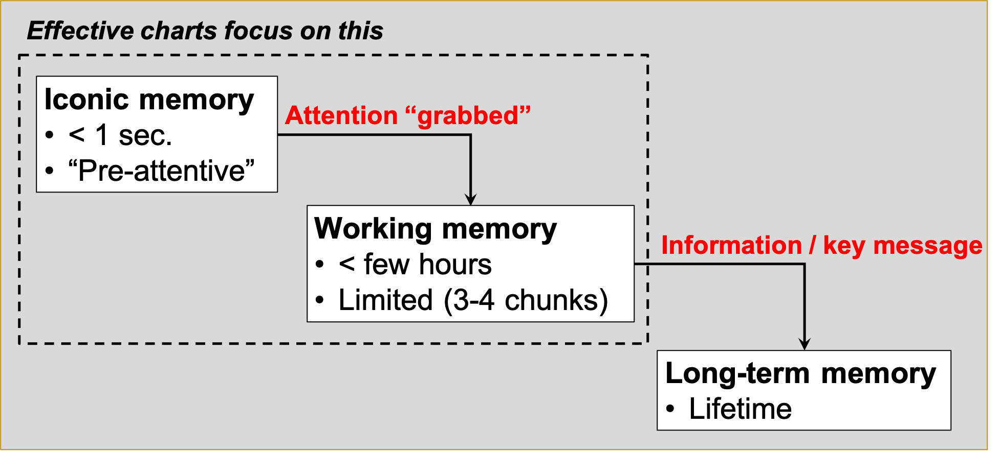
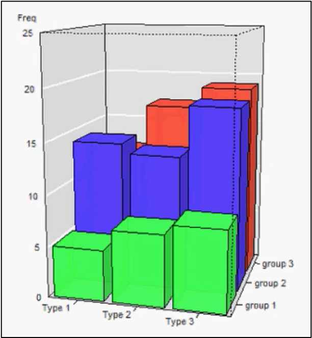
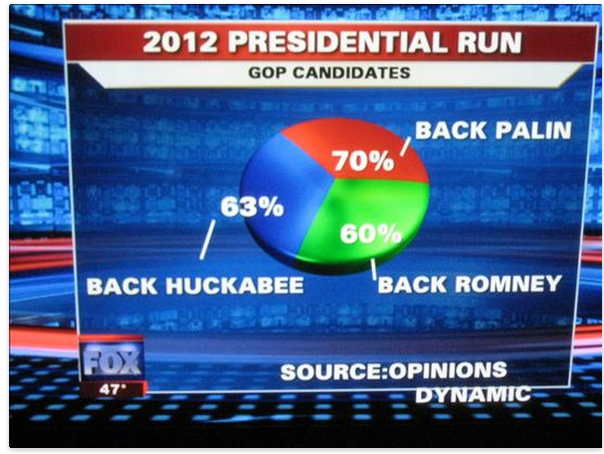
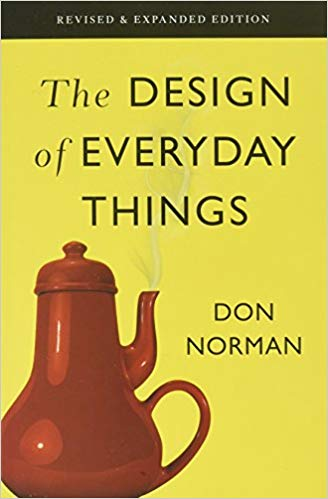
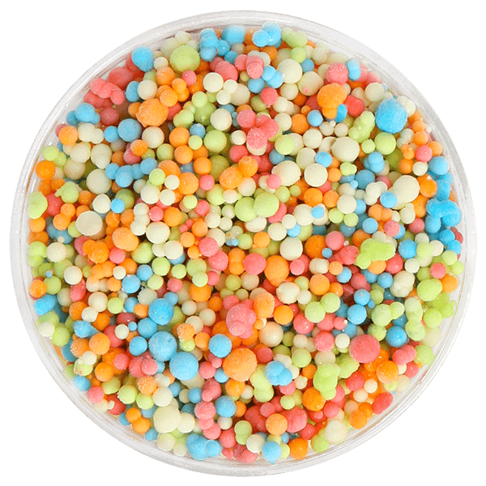

```{r setup, include=FALSE}
library(knitr)
library(tidyverse)
library(fontawesome)
library(countdown)
library(cowplot)
library(metathis)
library(here)
library(ggrepel)

options(
  htmltools.dir.version = FALSE,
  knitr.table.format = "html",
  knitr.kable.NA = '',
  dplyr.width = Inf,
  width = 250
)

knitr::opts_chunk$set(
  cache = FALSE,
  warning = FALSE,
  message = FALSE,
  fig.path = "figs/",
  fig.width = 7.252,
  fig.height = 4,
  comment = "#>",
  fig.retina = 3
)

# Setup xaringanExtra options
xaringanExtra::use_xaringan_extra(c(
  "tile_view", "panelset", "clipboard", "share_again"))
xaringanExtra::style_share_again(share_buttons = "none")
xaringanExtra::use_extra_styles(
  hover_code_line = TRUE,
  mute_unhighlighted_code = FALSE
)

# Set up website metadata
meta() %>%
  meta_general(
    description = rmarkdown::metadata$subtitle,
    generator = "xaringan and remark.js"
  ) %>%
  meta_name("github-repo" = "jhelvy/stories-with-data") %>%
  meta_social(
    title = rmarkdown::metadata$title,
    url = "https://jhelvy.github.io/stories-with-data/",
    og_type = "website",
    og_author = "John Paul Helveston",
    twitter_card_type = "summary_large_image",
    twitter_creator = "@johnhelveston"
  )

# Read in data
gapminder <- read_csv(here('data', 'gapminder.csv'))
milk_production  <- read_csv(here::here('data', 'milk_production.csv'))
milk_region <- milk_production %>%
    filter(region %in% c(
        'Pacific', 'Northeast', 'Lake States', 'Mountain')) %>%
    group_by(year, region) %>%
    summarise(milk_produced = sum(milk_produced)) %>%
    ungroup() %>%
    mutate(label = ifelse(year == max(year), region, NA))
federal_spending <- read_csv(here::here('data', 'federal_spending_long.csv'))
federal_spending_summary <- federal_spending %>%
    mutate(department = fct_other(
        department, keep = 'DOD')) %>%
    group_by(department, year) %>%
    summarise(rd_budget = sum(rd_budget) / 10^3) %>%
    ungroup() %>%
    mutate(department = fct_relevel(
        department, c('Other', 'DOD')))
```

background-image: url("images/nasa_global_preview.png")
background-size: cover

<br><br><br><br><br><br><br><br>

.rightcol80[.white[

# .fancy[`r rmarkdown::metadata$title`]

### `r rmarkdown::metadata$author`
### The George Washington University 
### Dept. of Engineering Management & Systems Engineering

]]

---

class: middle, center

# Download [this cheatsheet](https://jhelvy.github.io/stories-with-data/content/cheatsheet-dataviz.pdf) for today's content

---

class: middle

.border[
<center>

</center>
]

---

class: middle

<center>

</center>

.left[

From [here](https://psyteachr.github.io/msc-data-skills/ggplot.html)

]

---

class: inverse, middle

.rightcol80[

# "_Having word processing software<br>doesn't make us great writers._"

## — Stephen Few

]

---

class: center

.leftcol[

# We don't write paragraphs like this

<center>

</center>

.left[.font80[

Image from Few (2012, pg. 227)

]]]

--

.rightcol[

# So don't make<br>graphs like this

<center>

</center>

.center[.font80[

Image from excelcharts.com

]]]

---

```{r child="topics/0.Rmd"}
```

---

```{r child="topics/1.Rmd"}
```

---

class: center, middle, inverse

# Check out John Rauser's [talk](https://www.youtube.com/watch?v=fSgEeI2Xpdc) on YouTube

---

class: inverse, middle, center

# Good visualizations optimize for our<br> .orange[Visual-Memory System]

---

class: center

## A (very) simplified model of the visual-memory system

<center>

</center>

---

class: center

## A (very) simplified model of the visual-memory system

<center>

</center>

---

class: center

## A (very) simplified model of the visual-memory system

<center>

</center>

---

class: center

## A (very) simplified model of the visual-memory system

<center>

</center>

---

class: inverse, middle

# Two objectives of effective charts:

## 1. Grab & direct attention (iconic memory)
## 2. Reduce processing demands (working memory)

---

class: center

# The power of pre-attentive processing

## Count all the "5"s

--

<center>

</center>

---

class: center

# The power of pre-attentive processing

## Count all the "5s

--

<center>

</center>

---

class: center

.leftcol[

<center>

</center>

]

--

.rightcol[

## Pre-attentive attributes

<br>
<center>

</center>

]

---

class: center

.leftcol[

<center>

</center>

]

.rightcol[

## Pre-attentive attributes

### .red[Numerical (ratio) data]

<center>

</center>

]

---

class: center

.leftcol[

<center>

</center>

]

.rightcol[

## Pre-attentive attributes

### .red[Numerical (ratio) data]<br>.blue[Categorical (ordinal) data]

<center>

</center>

]

---

class: inverse, middle, center

# Not all pre-attentive attributes are equal

---

class: center

# Where is the red dot?

--

.cols3[

<center>

</center>

]

--

.cols3[

<center>

</center>

]

--

.cols3[

<center>

</center>

]

---

# .center[For categorical data:]

### 1. Hue (color) > shape
### 2. Less is more (stay in working memory!)

.cols3[

<center>

</center>

]

.cols3[

<center>

</center>

]

.cols3[

<center>

</center>

]

---

class: middle

.leftcol[

<center>
<br>

</center>

]

--

.rightcol[

<center>


</center>

]

---

background-image: url("images/trump_covid.jpg")
background-size: cover

---

class: inverse, middle, center

# What about _quantitative_ data?

---

class: middle

.leftcol60[

<center>

</center>

]

--

.rightcol40[

Cleveland, W. S., & McGill, R. (1985). Graphical perception and graphical methods for analyzing scientific data. Science, New Series, 229(4716), 828-833.

]

---

name: cleveland-estimation
class: center, middle

# .red[Estimation]: Hierarchy for _numerical_ data

<center>

</center>

.leftcol[

## .left[More Accurate]

]

.rightcol[

## .right[Less Accurate]

]

---

class: center

# Example: Life expectancy in countries in Asia

.leftcol[

```{r, echo=FALSE}
gapminder %>%
    filter(continent == "Asia") %>%
    filter(year == max(year)) %>%
    # Removing a "middle" country so that it's just 32 countries
    filter(country != "Sri Lanka") %>%
    mutate(country = ifelse(country == "Korea, Rep.", "Korea", country)) %>%
    arrange(lifeExp) %>%
    dplyr::select(country, lifeExp) %>%
    as.data.frame()
```

]

---

class: middle

.leftcol30[

1. Position on a common scale
2. Position on<br>non-aligned scales
3. Length
4. Angle
5. Area
6. Color saturation
7. **.red[Color hue]**

<br>

- `r fa("times", fill = "red")` **Discriminate**
- `r fa("times", fill = "red")` **Rank**
- `r fa("times", fill = "red")` **Ratio**

]

.right70[

<center>

</center>

]

---

class: middle

.leftcol30[

1. Position on a common scale
2. Position on<br>non-aligned scales
3. Length
4. Angle
5. Area
6. Color saturation
7. **.red[Color hue]**

Sorting helps a bit...

- `r fa("times", fill = "red")` **Discriminate**
- `r fa("check-square", fill = "green")` **Rank**
- `r fa("times", fill = "red")` **Ratio**

]

.right70[

<center>

</center>

]

---

class: middle

.leftcol30[

1. Position on a common scale
2. Position on<br>non-aligned scales
3. **.red[Length]**
4. Angle
5. Area
6. Color saturation
7. Color hue

<br>

- `r fa("check-square", fill = "green")` / `r fa("times", fill = "red")` **Discriminate**
- `r fa("check-square", fill = "green")` / `r fa("times", fill = "red")` **Rank**
- `r fa("check-square", fill = "green")` **Ratio**

]

.right70[

<center>

</center>

]

---

class: middle

.leftcol30[

1. Position on a common scale
2. **.red[Position on<br>non-aligned scales]**
3. Length
4. Angle
5. Area
6. Color saturation
7. Color hue

<br>

- `r fa("check-square", fill = "green")` / `r fa("times", fill = "red")` **Discriminate**
- `r fa("check-square", fill = "green")` / `r fa("times", fill = "red")` **Rank**
- `r fa("check-square", fill = "green")` **Ratio**

]

.right70[

<center>

</center>

]

---

class: middle

.leftcol30[

1. **.red[Position on a common scale]**
2. Position on<br>non-aligned scales
3. Length
4. Angle
5. Area
6. Color saturation
7. Color hue

<br>

- `r fa("check-square", fill = "green")` **Discriminate**
- `r fa("check-square", fill = "green")` **Rank**
- `r fa("check-square", fill = "green")` **Ratio**

]

.right70[

<center>

</center>

]

---

class: middle

.leftcol30[

1. **.red[Position on a common scale]**
2. Position on<br>non-aligned scales
3. Length
4. Angle
5. Area
6. Color saturation
7. Color hue

**.red[Sorting still matters!]**

]

.right70[

<center>

</center>

]

---

class: inverse, middle, center

# .font130[Gestalt Psychology]

<br>

### The whole has a reality that is entirely separate from the parts

---

class: middle
background-color: #FFFFFF

<center>

</center>

---

class: center
background-color: #FFFFFF

# Reification

<br>
<center>

</center>

---

class: center
background-color: #FFFFFF

.leftcol30[

# Emergence

]

.rightcol70[

<center>

</center>

]

---

background-color: #FFFFFF

.leftcol20[

# Law of Closure

Our minds fill in the missing information

]

.rightcol80[


]

---

class: inverse, center

# .font120[Prägnanz]

<br>

### We strongly prefer to interpret stimuli as regular, simple, and orderly

--

.cols3[

<center>

</center>

]

--

.cols3[

<center>

</center>

]

--

.cols3[

<center>

</center>

]

---

class: middle

.leftcol30[

# .font120[Prägnanz]

.font120[This should cause you cognitive pain]

It's the graphical equivalent of this:
<center>

</center>

]

.right70[

<center>

</center>

]

---

class: middle

.leftcol30[

# .font120[Prägnanz]

.font120[This makes our brains happy] 😊

]

.right70[

<center>

</center>

]

---

```{r child="topics/2.Rmd"}
```

---

```{r child="topics/bp0.Rmd"}
```

---

```{r child="topics/bp1.Rmd"}
```

---

class: inverse, middle

.rightcol80[

# "_Erase non-data ink._"
## — Ed Tufte

]

---

class: center, middle

.leftcol[

<center>


</center>

Figure 1.6: `Monstrous Costs’ by Nigel Holmes, in Healy, 2018

]

--

.rightcol[

<center>


</center>

]

---

class: middle

<center>

</center>

.left[Figure 24.1: From Data Looks Better Naked by Darkhorse Analytics]

---

class: center, middle

.leftcol[

<center>


</center>

]

--

.rightcol[

<center>


</center>

]

---

```{r child="topics/bp2.Rmd"}
```

---

class: center, middle

.leftcol[

## Humans aren't good at distinguishing 3D space

<center>

</center>

[Penrose Stairs](https://en.wikipedia.org/wiki/Penrose_stairs
), made famous by<br>M.C. Escher (1898-1972)

]

--

.rightcol[

## Ink proportions !=<br>true proportions

<center>

</center>

]

---

class: center, middle

# Occlusion: geoms are obscured

<center>

</center>

---

class: center, middle

.leftcol60[

<center>

</center>

]

.rightcol40[

# Multiple interpretations

]

---

class: center, middle

.leftcol40[

<center>


</center>

]

--

.rightcol60[

<center>

.border[]
</center>

]

---

class: center, middle

# The third dimension distracts from the data

## (this is what Tufte calls "chart junk")

<center>

</center>

---

class: center, middle

.leftcol60[

<center>


</center>

]

--

.rightcol40[


<center>

.border[]
</center>

]

---

```{r child="topics/bp3.Rmd"}
```

---

class: center, middle

### "Lie Factor" = $\frac{\text{Size of effect in graphic}}{\text{Size of effect in data}}$

---

class: center, middle

### "Lie Factor" = $\frac{\text{Size of effect in graphic}}{\text{Size of effect in data}} = \frac{\frac{5.3 - 0.6}{0.6}}{\frac{27.5 - 18}{18}} = \frac{7.83}{0.53} = 14.8$

.leftcol60[.border[

<center>

</center>
.font80[.left[Edward Tufte (2001) "The Visual Display of Quantitative Information", 2nd Edition, pg. 57-58.]]

]]

--

.rightcol40[.border[

<center>

</center>

]]

---

class: center, middle

# Bar charts should always start at 0

--

.leftcol60[

<center>


</center>

.font70[.left[

Image from http://livingqlikview.com/the-9-worst-data-visualizations-ever-created/

]]]

--

.rightcol40[

<center>

.border[]
</center>

]

---

class: center, middle

# Don't cherry-pick your data

--

.leftcol60[

<center>


</center>

.font70[.left[

Image from https://www.mediamatters.org/fox-news/fox-news-newest-dishonest-chart-immigration-enforcement

]]]

--

.rightcol40[

<center>

.border[]
</center>

]

---

class: center, middle

# Make sure your chart makes sense

<center>

</center>

.font70[.left[

Image from Image from http://livingqlikview.com/the-9-worst-data-visualizations-ever-created/

]]

---

```{r child="topics/bp4.Rmd"}
```

---

class: middle, center
background-color: #FFFFFF

.leftcol45[

<center>


</center>

]

--

.rightcol55[

<center>


</center>

]

---

class: middle
background-color: #FFFFFF

.leftcol45[

# Exceptions:

## - Small data
## - Simple fractions
## - If sum of parts matters

]

--

.rightcol55[

<center>

</center>

]

---

class: middle, center
background-color: #FFFFFF

# Best pie chart of all time

<center>

</center>

---

```{r child="topics/bp5.Rmd"}
```

---

class: middle, center

# Stacked bars are rarely a good idea

.border[
<center>

</center>
]

---

class: middle, center

## "Parallel coordinates" plot usually works better

.leftcol[.border[

<center>

</center>

]]

.rightcol[.border[

<center>

</center>

]]

---

class: middle, center

## Exception:<br>When you care about the _total_ more than the categories

.leftcol60[.border[

<center>

</center>

]]

--

.rightcol40[.border[

<center>

</center>

]]

---

```{r child="topics/bp6.Rmd"}
```

---

class: middle, center

## Rotate axes if you can't read them

.leftcol45[

<center>

.border[]
</center>

]

--

.rightcol55[

<center>

.border[]
</center>

]

---

class: middle, center

## Default order is almost always wrong

.leftcol[

<center>

Ordered by alphabet (default)
.border[]
</center>

]

--

.rightcol[

<center>

Ordered by count
.border[]
</center>

]

---

class: center

## Exception: Ordinal variables

<center>
.border[]
</center>

---

```{r child="topics/bp7.Rmd"}
```

---

class: center, middle, inverse

# Legends suck

---

class: center

# Legends suck

.leftcol[

### Legends require look-up task

```{r fed_spending_legend, echo=FALSE, fig.height=5, fig.width=7, fig.align='center'}
ggplot(federal_spending_summary) +
  geom_area(
    aes(x = year, y = rd_budget, fill = department)) +
  scale_y_continuous(
    expand = expand_scale(mult = c(0, 0.05))) +
  scale_fill_manual(values = c('grey', 'sienna')) +
  theme_minimal_hgrid() +
  labs(
    x = NULL,
    y = 'R&D Budget ($ Billions)',
    fill = 'Department',
    title = 'Federal R&D spending, 1976 - 2017',
    subtitle = 'Source: AAAS Historical Trends')
```

]

--

.rightcol[

### Direct labeling is much better

```{r, fed_spending_annotate, echo=FALSE, fig.height=5, fig.width=7, fig.align='center'}
dod_spending <- ggplot(federal_spending_summary) +
    geom_area(aes(x = year, y = rd_budget,
                  fill = department)) +
    annotate(geom = 'text', x = 1995, y = 85,  #<<
             label = 'Other', size = 6, color = 'black') + #<<
    annotate(geom = 'text', x = 1995, y = 25, #<<
             label = 'DOD', size = 6, color = 'white') + #<<
    scale_y_continuous(
        expand = expand_scale(mult = c(0, 0.05))) +
    scale_fill_manual(values = c('grey', 'sienna')) +
    theme_minimal_hgrid() +
    theme(legend.position = 'none') +
    labs(x = NULL,
         y = 'R&D Budget ($ Billions)',
         title = 'Federal R&D spending, 1976 - 2017',
         subtitle = 'Source: AAAS Historical Trends')

dod_spending
```

]

---

class: middle, center

## Directly label geoms

.leftcol[

<center>

.border[]
</center>

]

--

.rightcol[

<center>

.border[]
</center>

]

---

class: center

## Exception: When you have repeated categories

<center>
.border[]
</center>

---

```{r child="topics/bp8.Rmd"}
```

---

class: middle
background-color: #f8f8f8

<center>

</center>

---

class: middle, center

.leftcol[

<center>

.border[]
</center>

]

--

.rightcol[

<center>

.border[]
</center>

]

---

```{r child="topics/bp9.Rmd"}
```

---

class: center

# 10% of males and 1% of females are color blind

--

.leftcol[

<center>
.border[]
</center>

]

--

.rightcol[

<center>
.border[]
</center>

]

---

class: middle, center

## Facets can be used to avoid color altogether

.leftcol[

<center>

.border[]
</center>

]

--

.rightcol[

<center>

.border[]
</center>

]

---

```{r child="topics/bp10.Rmd"}
```

---

class: middle
background-color: #FFFFFF

<center>

</center>

---

class: middle
background-color: #FFFFFF

<center>

</center>

---

class: center, middle

## Who do you think did a better job in tonight’s debate?

| | Clinton | Trump |
|-|-|-|
| Among Democrats | 99% | 1% |
| Among Republicans | 53% | 47% |

---

class: inverse

# Your turn - go [here](https://docs.google.com/presentation/d/1sL3k4S2e7shShlu_crNxunEH8qMHtuOH_vl_a_Mc1wI/edit?usp=sharing)

For your "bad" visualization:

1) Identify where the graphic falls on Cleveland's pattern recognition hierarchy

<center>

</center>

2) Any design rules that are broken

3) Suggest at least two improvements

```{r, echo=FALSE}
countdown(
    minutes = 10,
    warn_when = 30,
    update_every = 1,
    top = 0,
    right = 0,
    font_size = '2em'
)
```

---

class: middle

<center>

</center>

---

class: middle

.leftcol40[

<center>

</center>

]

--

.rightcol60[

<center>

</center>

]

---

class: middle

.leftcol40[

<center>

</center>

]

--

.rightcol60[

<center>


</center>

]

---

class: middle

.leftcol45[

<center>

</center>

]

--

.rightcol55[

<center>

</center>

]

---

class: middle

.cols3[

<center>

</center>

]

--

.cols3[

<center>

</center>

]

--

.cols3[

<center>

</center>

]

---

class: inverse, center

```{r, echo=FALSE}
countdown(
    minutes = 5,
    warn_when = 30,
    update_every = 1,
    left = 0, right = 0, top = 1, bottom = 0,
    margin = "5%",
    font_size = "8em"
)
```

# Intermission!

## Stand up, Move around, Stretch!

---

```{r child="topics/3.Rmd"}
```

---

class: center, inverse, middle

# **Data Viz Goal**:<br>Translate _data_ into _information_

---

class: center

# Translate _data_ into _information_

--

.leftcol[

**Data**

Average student engagement scores

 Class       | Type | City | County
 ------------|-------------|------|-------
 Special Ed. | Charter     | 643  | 793
 Special Ed. | Public      | 735  | 928
 General Ed. | Charter     | 590  | 724
 General Ed. | Public      | 863  | 662

]

--

.rightcol[

**Information**

```{r student-engagement-final, echo=FALSE, fig.width=6, fig.height=5}
engagement <- data.frame(
    City   = c(643, 735, 590, 863),
    County = c(793, 928, 724, 662),
    School = c('Special Ed., Charter', 'Special Ed., Public',
               'General Ed., Charter', 'General Ed., Public'),
    Highlight = c(0, 0, 0, 1)) %>%
    gather(Location, Engagement, City:County) %>%
    mutate(
      Location = fct_relevel(Location, c('City', 'County')),
      Highlight = as.factor(Highlight),
      x = ifelse(Location == 'County', 1, 0))
engagement_plot <- engagement %>%
    ggplot(aes(x = x, y = Engagement, group = School, color = Highlight)) +
    geom_point() +
    geom_line() +
    scale_color_manual(values = c('#757575', '#ed573e')) +
    labs(x = 'Sex', y = 'Engagement',
         title = paste0('Students in public, general education classes\n',
                        'in county schools have surprisingly low engagement')) +
    scale_x_continuous(limits = c(-1.2, 1.2), labels = c('City', 'County'),
                       breaks = c(0, 1)) +
    geom_text_repel(aes(label = Engagement, color = as.factor(Highlight)),
                    data          = subset(engagement, Location == 'County'),
                    size          = 5,
                    nudge_x       = 0.1,
                    segment.color = NA) +
    geom_text_repel(aes(label = Engagement, color = as.factor(Highlight)),
                    data          = subset(engagement, Location == 'City'),
                    size          = 5,
                    nudge_x       = -0.1,
                    segment.color = NA) +
    geom_text_repel(aes(label = School, color = as.factor(Highlight)),
                    data          = subset(engagement, Location == 'City'),
                    size          = 5,
                    nudge_x       = -0.25,
                    hjust         = 1,
                    segment.color = NA) +
    theme_cowplot() +
    background_grid(major = 'x') +
    theme(axis.line = element_blank(),
          axis.title.x = element_blank(),
          axis.title.y = element_blank(),
          axis.text.y = element_blank(),
          axis.ticks = element_blank(),
          legend.position = 'none')
engagement_plot
```

]

---

# Data exploration: an iterative process

--

.leftcol[

Encode data:

.code60[

```{r}
engagement_data <- data.frame(
    City   = c(643, 735, 590, 863),
    County = c(793, 928, 724, 662),
    School = c('Special Ed., Charter', 'Special Ed., Public',
               'General Ed., Charter', 'General Ed., Public'))
engagement_data
```

]]

--

.rightcol[

Re-format data for plotting:

.code60[

```{r}
engagement_data <- engagement_data %>%
    gather(Location, Engagement, City:County) %>%
    mutate(Location = fct_relevel(
      Location, c('City', 'County')))
engagement_data
```

]]

---

# Data exploration: an iterative process

.leftcol[

Initial exploratory plotting:

.code60[

```{r student-engagement-bars1, fig.width=6, fig.height=3}
engagement_data %>%
    ggplot() +
    geom_col(aes(x = Engagement, y = School,
                 fill = Location),
             position = 'dodge')
```

]]

--

.rightcol[

More exploratory plotting:<br>highlight difference

```{r student-engagement-bars2, echo=FALSE, fig.width=6, fig.height=5}
engagement %>%
    mutate(Highlight = as.factor(Highlight)) %>%
    ggplot(aes(x=x, y=Engagement, group=School, color=School)) +
    geom_point() +
    geom_line() +
    labs(x='Sex', y='Engagement')
```

]

---

# Data exploration: an iterative process

.leftcol[

Directly label figure:

```{r student-engagement-bars3, echo=FALSE, fig.width=6, fig.height=5}
engagement %>%
    mutate(Highlight = as.factor(Highlight)) %>%
    ggplot(aes(x=x, y=Engagement, group=School, color=School)) +
    geom_point() +
    geom_line() +
    labs(x='Location', y='Engagement') +
    theme_cowplot() +
    scale_x_continuous(limits = c(-0.2, 2), labels = c('City', 'County'),
                       breaks = c(0, 1)) +
    theme(legend.position = 'none') +
    geom_text_repel(aes(label = School, color = as.factor(School)),
                    data          = subset(engagement, Location == 'County'),
                    size          = 5,
                    nudge_x       = 0.2,
                    hjust         = 0,
                    segment.color = NA)
```

]

--

.rightcol[

Remove unnecessary axes, change colors, fix labels:

```{r, ref.label='student-engagement-final', echo=FALSE, fig.width=6, fig.height=5}
```

]

---

class: center, middle, inverse

# Your message should be _obvious_

---

class: middle

<center>

</center>

---

.leftcol[

# Norman door (n.):

1. A door where the design tells you to do the opposite of what you're actually supposed to do.

2. A door that gives the wrong signal and needs a sign to correct it.

]

.rightcol[

<center>

</center>

]

---

class: center

.leftcol[

# Norman door
<center>


</center>

]

--

.rightcol[

# Non-Norman door
<center>


</center>

]

---

class: center, middle, inverse

# Text is usually the single most important component on your chart

---

class: middle

<center>

</center>

.font80[Michelle Borkin, et al. (2015) [Beyond Memorability: Visualization Recognition and Recall](https://ieeexplore.ieee.org/document/7192646)]

---

class: center

.leftcol60[

<center>

</center>

]

.rightcol40[

## Titles matter

<br><br><br><br><br><br><br><br><br><br><br>

Source: https://www.reddit.com/r/dataisugly/comments/odk65x/this_was_not_the_right_headline_to_go_along_with

]

---

.leftcol60[

<center>

</center>

]

.rightcol40[

## Good annotations should tell a story

<br><br><br><br><br><br><br><br><br><br>

Source: https://ourworldindata.org/less-meat-or-sustainable-meat

]


---

class: inverse, center, middle

# Fonts matter

.leftcol[

<center>

</center>

"Fast Taco"

]

.rightcol[

<center>

</center>

"Mega Flicks"

]

---

class: inverse, center, middle

<center>

</center>

---

# .center[Use fonts with **same-height** numbers]

<br>

.leftcol35[.right[

## "Oldstyle" (bad)

<br>

## Lining (good)

]]

.rightcol65[


]

---

# .center[Use fonts with **same-width** numbers]

<br>

.leftcol40[.right[

## "Proportional" (bad)

<br>

## "Tabular" (good)

]]

.rightcol60[


]

---

## .center[Font families you should consider using]

.leftcol30[.font120[

<p style="font-family: Roboto;">Roboto</p>

<p style="font-family: Source Code Pro;">Source</p>

<p style="font-family: Fira Sans;">Fira</p>

<p style="font-family: Alegreya;">Alegreya</p>

<p style="font-family: Lato;">Lato</p>

]]

.rightcol70[

Download:

- Individually from https://fonts.google.com/
- All of these with [this zip file](https://github.com/emse-eda-gwu/2022-Fall/raw/main/content/fonts.zip)

]

---

## Use fonts to create **hierarchy**

.leftcol[

```
# Hierarchy

## Hierarchy

### Hierarchy

#### Hierarchy
```

]

.rightcol[

# Hierarchy

## Hierarchy

### Hierarchy

#### Hierarchy

]

---

.leftcol[

Title<br>This is some text that goes into detail and explains a lot more about the topic described in the title. Here's some random Latin words: Lorem ipsum dolor sit amet, consectetur adipiscing elit, sed do eiusmod tempor incididunt ut labore et dolore magna aliqua.

]

---

.leftcol[

# Size

This is some text that goes into detail and explains a lot more about the topic described in the title. Here's some random Latin words: Lorem ipsum dolor sit amet, consectetur adipiscing elit, sed do eiusmod tempor incididunt ut labore et dolore magna aliqua.

]

---

.leftcol[

**Weight**

This is some text that goes into detail and explains a lot more about the topic described in the title. Here's some random Latin words: Lorem ipsum dolor sit amet, consectetur adipiscing elit, sed do eiusmod tempor incididunt ut labore et dolore magna aliqua.

]

---

.leftcol[

.red[Color]

This is some text that goes into detail and explains a lot more about the topic described in the title. Here's some random Latin words: Lorem ipsum dolor sit amet, consectetur adipiscing elit, sed do eiusmod tempor incididunt ut labore et dolore magna aliqua.

]

---

.leftcol[

Spacing

<br>

This is some text that goes into detail and explains a lot more about the topic described in the title. Here's some random Latin words: Lorem ipsum dolor sit amet, consectetur adipiscing elit, sed do eiusmod tempor incididunt ut labore et dolore magna aliqua.

]

---

.leftcol[

Typeface

<p style="font-family: Alegreya;">
This is some text that goes into detail and explains a lot more about the topic described in the title. Here's some random Latin words: Lorem ipsum dolor sit amet, consectetur adipiscing elit, sed do eiusmod tempor incididunt ut labore et dolore magna aliqua.
</p>

]

---

.leftcol[

<h2 style="font-family: Roboto Condensed; color: #a5442b;">Title</h2>
<h3 style="font-family: Alegreya;">Subtitle</h3>

<p style="font-family: Roboto;">
This is some text that goes into detail and explains a lot more about the topic described in the title. Here's some random Latin words: Lorem ipsum dolor sit amet, consectetur adipiscing elit, sed do eiusmod tempor incididunt ut labore et dolore magna aliqua.
</p>

]


---

class: inverse, middle, center

# Show amounts with:

.cols3[

<br>
<center>

<center>

]

.cols3[

<center>

<center>

]

.cols3[

<center>

<center>

]

---

class: center, middle

.cols3[

<center>

<center>

## Bar chart

<center>

<center>

]

.cols3[

<center>

<center>

## Dot chart

<center>

<center>

]

.cols3[

<center>

<center>

## Lollipop chart

<center>

<center>

]

---

class: center

## Bars are good for highlighting specific categories

<center>

<center>

---

## Use lollipops when:

### - The bars are overwhelming<br> - You're not highlighting categories

<!-- Idea from https://www.data-to-viz.com/graph/lollipop.html -->

.leftcol[

<center>

<center>

]

.rightcol[

<center>

<center>

]

---

class: center

## Or use dots and don't set axis to 0

.leftcol[

<center>

<center>

]

.rightcol[

<center>

<center>

]

---

class: inverse, middle, center

# Show proportions with:

.cols3[

<br>
<center>

<center>

]

.cols3[

<center>

<center>

]

.cols3[

<center>

<center>

]

---

class: center, middle

.cols3[

<center>

<center>

## Bar charts

<center>

<center>

]

.cols3[

<center>

<center>

## Pie charts

<center>

<center>

]

.cols3[

<center>

<center>

## Waffle charts

<center>

<center>

]

---

class: center

## Stacked bars: better with only a few categories

.leftcol[

<center>

</center>

]

.rightcol[

<center>

</center>

]

---

class: center 

# Stacked vs. Dodged Bars 

.leftcol[

### Stacked is better for comparing **total**

<center>

</center>

]

.rightcol[

### Dodged is better for comparing **parts**

<center>

</center>

]

---

## .center[Where stacking is useful]

.leftcol60[

<center>

</center>

.font70[https://fivethirtyeight.com/features/the-dollar-and-cents-case-against-hollywoods-exclusion-of-women/]

]

.rightcol40[

### - **2 to 3 groups**
### - Proportions over time

]

---

## .center[Where stacking is useful]

.leftcol60[

<center>

</center>

.font80[https://www.perceptualedge.com/blog/?p=2239]

]

.rightcol40[

### - 2 to 3 groups
### - **Proportions over time**

]

---

class: center

## Pies are still useful if the sum of components matters

.cols3[

<center>

<center>

]

.cols3[

<br>
<center>

<center>

]

.cols3[

<br>
<br>
<center>

<center>

]

---

class: center

## The best pies are **square pies**

<center>

</center>

.font80[https://eagereyes.org/blog/2016/a-reanalysis-of-a-study-about-square-pie-charts-from-2009]
